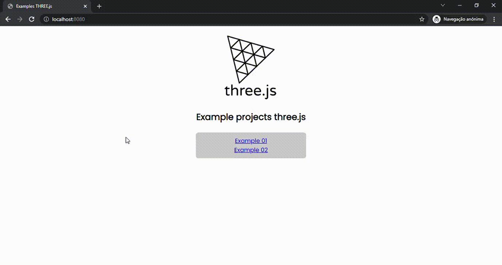

<p align="center">
    
</p>
<h2 align="center">Examples three.js</h2>
<hr>

#### Three.js é uma biblioteca JavaScript/API cross-browser usada para criar e mostrar gráficos 3D animados em um navegador web. Three.js usa WebGL. [documentação do three.js](https://github.com/mrdoob/three.js)


## Objetivo
#### Criar exemplos de projetos utilizando a biblioteca `three.js` e explorar seus components e recursos.


## Dependências
- [three.js](https://www.npmjs.com/package/three)
- [webpack-mix](https://www.npmjs.com/package/webpack-mix)


## Instalação
```JS
npm install && npm
```

## Executar projeto
```jS
npm hot //open browser localhost:8080
```

